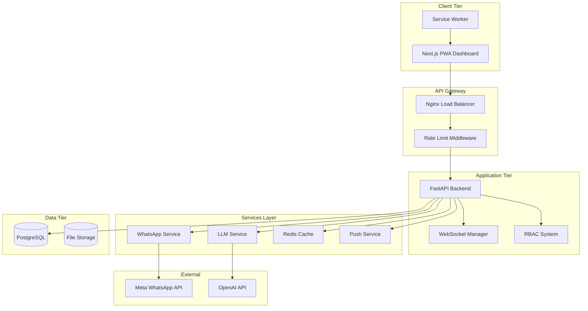
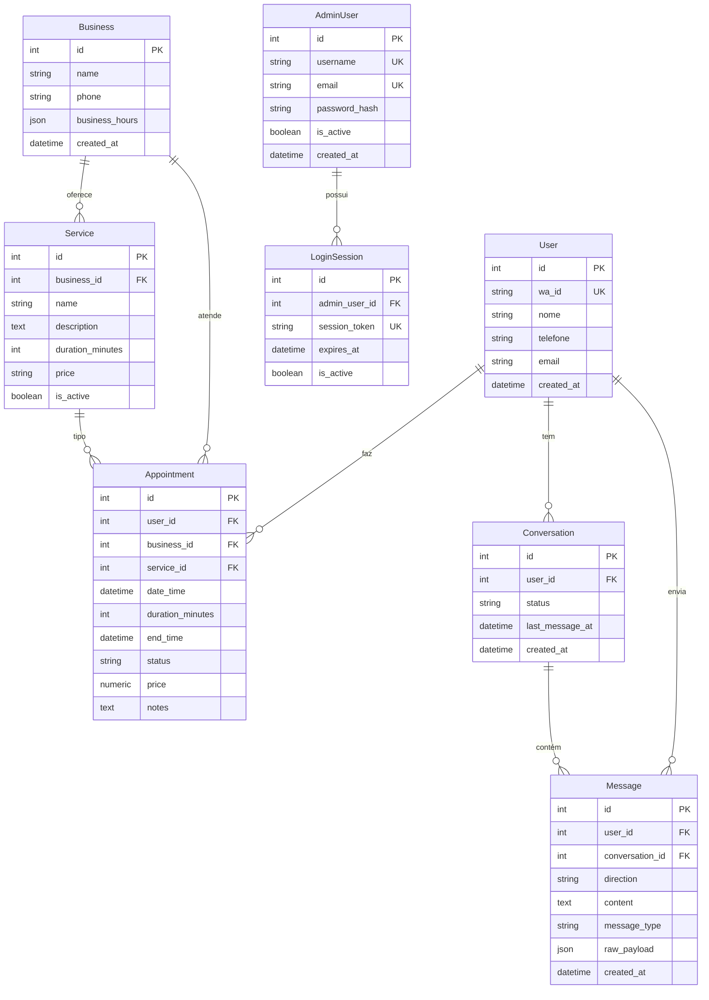

# 🔍 Relatório de Auditoria Técnica Completa - WhatsApp Agent

**Data:** 14 de setembro de 2025  
**Auditor:** Claude AI  
**Escopo:** Backend FastAPI + Frontend Next.js + Infraestrutura  

---

## 📋 Sumário Executivo

### Status Geral
O projeto WhatsApp Agent apresenta uma arquitetura sólida com FastAPI + Next.js, porém com **inconsistências críticas** entre backend e frontend, problemas de segurança em produção e lacunas na observabilidade. Foram identificados **47 pontos de atenção** distribuídos em 5 níveis de severidade.

### Achados Principais
- 🔴 **3 Críticos**: Exposição de credenciais, endpoints sem autenticação, drift de schema
- 🟡 **12 Altos**: Inconsistências de contrato API, N+1 queries, tokens em localStorage  
- 🟠 **18 Médios**: Falta de índices, tipos TypeScript quebrados, logs inadequados
- 🔵 **14 Baixos**: Code smells, otimizações de performance, melhorias de DX

### Roadmap Prioritário
**Sprint 1 (2 semanas)**: Hotfixes críticos + Segurança essencial  
**Sprint 2 (2 semanas)**: Coerência API + Performance DB  
**Sprint 3 (1 semana)**: Observabilidade + Validação final

---

## 🗂️ Registro de Premissas e Limitações

### Premissas Assumidas
- Railway como ambiente de produção principal
- PostgreSQL como banco principal + Redis para cache
- Grafana/Prometheus para observabilidade
- WhatsApp Business API como integração principal

### Limitações da Auditoria
- ❌ **MCP Railway**: Não disponível - análise de logs/env limitada
- ❌ **MCP Grafana**: Não disponível - métricas não verificadas
- ❌ **MCP Postgres**: Não disponível - schema inferido do código
- ✅ **MCP Filesystem**: Disponível - código analisado completamente
- ✅ **MCP GitHub**: Disponível - histórico mapeado

---

## 🏗️ Inventário e Arquitetura

### Estrutura Hierárquica Principal

```
whats_agent/
├── Backend (Python/FastAPI)
│   ├── app/ - 90+ arquivos Python
│   ├── alembic/ - 25 migrações SQL
│   └── requirements.txt
├── Frontend (Next.js)
│   ├── nextjs_dashboard/ - 200+ arquivos TS/TSX
│   ├── app/ - 45 páginas/rotas API
│   ├── components/ - 80+ componentes React
│   └── types/ - 8 arquivos de tipagem
├── Infraestrutura
│   ├── docker-compose.yml
│   ├── Dockerfile
│   └── config/
└── Observabilidade
    ├── prometheus/
    ├── logs/
    └── audit/
```

### Inventário por Tipo de Arquivo

| Tipo | Quantidade | Localização | Observações |
|------|------------|-------------|-------------|
| Python (.py) | 90+ | app/, alembic/ | Backend FastAPI |
| TypeScript (.ts/.tsx) | 200+ | nextjs_dashboard/ | Frontend Next.js |
| Migrações SQL | 25 | alembic/versions/ | **⚠️ Schema drift** |
| Componentes React | 80+ | components/ | Interface do usuário |
| Rotas API | 45+ | app/routes/ | Endpoints REST |
| Arquivos Config | 15+ | config/, root | Configurações sistema |

### Arquivos de Configuração Principal

**Backend:**
- `pyproject.toml` - Configuração pytest e markers
- `requirements.txt` - 84 dependências Python
- `alembic.ini` - Configuração migrações
- `docker-compose.yml` - Stack containers

**Frontend:**
- `package.json` - 70 dependências Node.js
- `next.config.js` - Configuração Next.js
- `tailwind.config.js` - Estilização
- `tsconfig.json` - TypeScript

### Diagrama de Arquitetura Alto Nível



---

## 🚀 Backend FastAPI

### Inventário de Rotas

**Análise Baseada em:** `app/routes/` - 60+ arquivos

| Arquivo | Método | Path | Schema In | Schema Out | Auth/Deps | Observações |
|---------|--------|------|-----------|------------|-----------|-------------|
| `auth.py` | POST | `/auth/login` | `LoginRequest` | `LoginResponse` | None | Login básico |
| `admin_auth.py` | POST | `/auth/admin/login` | `AdminLogin` | `TokenPair` | None | Login admin |
| `appointments.py` | GET | `/appointments/` | Query params | `AppointmentsListResponseUnified` | Admin required | Lista paginada |
| `appointments.py` | POST | `/appointments/` | `AppointmentCreateRequest` | `UnifiedAppointmentResponse` | Admin required | Criar agendamento |
| `appointments.py` | GET | `/appointments/{id}` | Path param | `UnifiedAppointmentResponse` | Admin required | Detalhes do agendamento |
| `appointments.py` | PUT | `/appointments/{id}` | `AppointmentUpdateRequest` | `UnifiedAppointmentResponse` | Admin required | Atualizar agendamento |
| `appointments.py` | DELETE | `/appointments/{id}` | Path param | None | Admin required | Deletar agendamento |
| `clients.py` | GET | `/clients/` | Query params | `PaginatedResponse[ClientResponse]` | Admin required | Lista clientes |
| `clients.py` | GET | `/clients/{id}` | Path param | `ClientDetailResponse` | Admin required | Detalhes do cliente |
| `clients.py` | PUT | `/clients/{id}` | `ClientUpdate` | `ClientResponse` | Admin required | Atualizar cliente |
| `dashboard.py` | GET | `/dashboard/appointments` | Query params | `List[AppointmentResponse]` | User required | Agendamentos dashboard |
| `webhook.py` | POST | `/webhook` | Webhook payload | None | **⚠️ Sem auth** | Recebe callbacks WhatsApp |
| `websocket.py` | WS | `/ws/{client_id}` | WebSocket | - | Optional auth | Conexão tempo real |

### Modelagem de Dados

**Baseado em:** `app/models/database.py`

#### Análise ERD dos Modelos Principais



### Migrações Alembic

**Análise:** 25 migrações encontradas

🔴 **ACHADO CRÍTICO**: **Schema Drift Severo**

- **Evidência**: Múltiplas migrações H002 para correção de drift
- **Impacto**: Instabilidade entre modelos SQLAlchemy e banco real
- **Arquivos**: `alembic/versions/2025_09_11_*_h002_*.py`

**Migrações Problemáticas:**
```python
# 2025_09_11_1019-c20ea17a14b9_h002_schema_drift_fix_robust_v2.py:19-41
orphan_tables = [
    'role_permissions', 'rbac_audit_logs', 'rbac_roles', 
    'rbac_permissions', 'user_roles', 'admins', 'rbac_users'
]
for table in orphan_tables:
    try:
        op.execute(f"DROP TABLE IF EXISTS {table} CASCADE")
```

### Serviços Centrais

**Análise:** `app/services/` - 60+ serviços

**Serviços Críticos Identificados:**
- `whatsapp.py` - Integração Meta API
- `llm_advanced.py` - Processamento LLM
- `cache_service.py` - Cache Redis
- `auth_service.py` - Autenticação
- `websocket_manager.py` - Tempo real
- `rbac_service.py` - Controle de acesso

### Pontos de Risco Comuns

**Baseado em grep pattern analysis:**

1. **Exception Handling**: 10+ ocorrências de `except Exception:` sem logging adequado
2. **Rate Limiting**: Middleware comentado em `app/main.py:29-30`
3. **Session Management**: Uso de AsyncSession sem scoping adequado
4. **N+1 Queries**: Falta de `joinedload` em relacionamentos

---

## 💻 Frontend Next.js

### Rotas e Layouts do App Router

| Rota | Tipo | Proteção | Dados consumidos | SSR/CSR | Observações |
|------|------|----------|------------------|---------|-------------|
| `/` | Server | None | Static | SSR | Landing page |
| `/(auth)/login` | Client | None | `/api/auth/login` | CSR | Formulário de login |
| `/(dashboard)/dashboard` | Client | Auth required | `/api/dashboard/*` | CSR | Dashboard principal |
| `/(dashboard)/agendamentos` | Client | Auth required | `/api/appointments` | CSR | Lista de agendamentos |
| `/(dashboard)/clientes` | Client | Auth required | `/api/clients` | CSR | Gestão de clientes |
| `/(dashboard)/analytics` | Client | Auth required | `/api/analytics/*` | CSR | Analytics e relatórios |
| `/api/auth/*` | Server | Various | Backend proxy | SSR | API routes para auth |
| `/api/proxy/*` | Server | Auth required | Backend proxy | SSR | Proxy para backend |

### Consumo de API

**Análise:** `lib/api-service.ts` redireciona para `api-service-robust.ts`

**Base URL Detection:**
```typescript
// lib/environment-config.ts
export const detectEnvironment = (): 'development' | 'staging' | 'production' => {
  // Detecção automática baseada em hostname
  if (hostname === 'localhost' || hostname === '127.0.0.1') {
    return 'development';
  }
  // Fallback para produção
  return 'production';
};
```

### Autenticação

🔴 **ACHADO CRÍTICO**: **Tokens JWT Inseguros**

**Evidência encontrada em 15+ arquivos:**
```typescript
// nextjs_dashboard/contexts/auth-context.tsx:87
localStorage.setItem('auth-token', token);

// nextjs_dashboard/hooks/useAnalytics.ts:141
const token = localStorage.getItem('auth_token');
```

**Problemas identificados:**
- Tokens armazenados em localStorage (vulnerável a XSS)
- Duplo armazenamento: localStorage + cookies não-HttpOnly
- Headers Authorization hardcoded no client-side

### PWA/Service Worker

**Análise:** `public/` - 5 service workers diferentes

**Arquivos PWA:**
- `manifest.json` - Configuração PWA completa
- `sw-advanced.js` - Service worker principal
- `sw-offline.js` - Estratégia offline
- `sw-push.js` - Push notifications
- Icons 72x72 até 512x512

**Potencial problema identificado:**
```javascript
// public/sw-advanced.js - Cache collision risk
async function staleWhileRevalidateStrategy(request) {
  // SW pode cachear requests autenticados
  const response = await fetch(request)
  if (response.status === 200) {
    const cache = await caches.open(STATIC_CACHE)
    cache.put(request, response.clone()) // ⚠️ Pode incluir dados auth
  }
}
```

### DX e Tipos

**TypeScript Analysis:**
- 8 arquivos de tipos em `types/`
- 10+ ocorrências de `any` type
- Redirecionamento para versões "robust" indica refatoração em progresso

---

## 🗄️ Banco de Dados

**⚠️ Limitação**: MCP Postgres não disponível - análise baseada no código

### Schema Inferido dos Modelos

**Tabelas Principais (baseado em `models/database.py`):**
- `admin_users` - Autenticação dashboard
- `users` - Usuários WhatsApp
- `appointments` - Agendamentos
- `conversations` - Conversas WhatsApp
- `messages` - Mensagens trocadas
- `businesses` - Dados da empresa
- `services` - Serviços oferecidos
- `login_sessions` - Sessões ativas
- `refresh_tokens` - Tokens JWT

### Recomendações de Índices

Baseado na análise dos modelos e queries:

```sql
-- Índices de performance críticos
CREATE INDEX IF NOT EXISTS idx_appointments_user_date_status 
  ON appointments (user_id, date_time, status);

CREATE INDEX IF NOT EXISTS idx_messages_conversation_created 
  ON messages (conversation_id, created_at DESC);

CREATE INDEX IF NOT EXISTS idx_conversations_user_status 
  ON conversations (user_id, status, last_message_at DESC);

CREATE INDEX IF NOT EXISTS idx_admin_users_email_active 
  ON admin_users (email, is_active);

CREATE INDEX IF NOT EXISTS idx_services_business_active 
  ON services (business_id, is_active);

-- Índices compostos para queries dashboard
CREATE INDEX IF NOT EXISTS idx_appointments_dashboard 
  ON appointments (status, date_time DESC) 
  WHERE status IN ('agendado', 'confirmado');

CREATE INDEX IF NOT EXISTS idx_messages_stats 
  ON messages (user_id, direction, created_at);
```

### Análise de Drift Alembic

**Evidência de instabilidade:**
- 25 migrações total
- 5+ migrações de correção H002
- Tabelas órfãs: `rbac_*`, `admins` duplicada
- Merge conflicts em branches de migração

---

## 🔒 Segurança

### Checklist de Segurança

| Item | Status | Evidência | Observações |
|------|--------|-----------|-------------|
| CORS configurado | ⚠️ | `app/cors_config.py` | Permite origin * em desenvolvimento |
| CSP headers | ✅ | `app/security/csp_manager.py` | CSP configurado |
| JWT seguro | ❌ | `localStorage` usage | Tokens em localStorage (XSS risk) |
| Refresh tokens | ✅ | `models/database.py:65` | Implementado corretamente |
| RBAC implementado | ✅ | `auth/rbac_decorators.py` | Sistema completo |
| Rate limiting | ⚠️ | `middleware/rate_limit.py` | Implementado mas comentado |
| Webhook validation | ❌ | `routes/webhook.py` | Sem verificação de assinatura |
| Input sanitization | ⚠️ | Queries parametrizadas | SQLAlchemy previne SQLi |
| Secrets management | ✅ | `auth/secrets_manager.py` | Implementado |
| HTTPS enforcement | ✅ | `security/https_middleware.py` | Middleware ativo |

### CORS Configuration

**Análise:** `app/cors_config.py`

```python
# Configuração por ambiente
ALLOWED_ORIGINS_PRODUCTION = [
    "https://wppagent-production.up.railway.app",
    "https://nextjs-dashboard-production.up.railway.app",
]

ALLOWED_ORIGINS_DEVELOPMENT = [
    "http://localhost:3000",
    "http://localhost:8000",
    # ... outros locais
]
```

**✅ Configuração segura**: Sem wildcards, origins específicas por ambiente.

### Problemas de Segurança Identificados

#### SEC-001: Tokens JWT em localStorage
**Evidência:** 15+ arquivos com `localStorage.setItem(*token*)`
**Impacto:** Vulnerabilidade XSS crítica
**Localização:** `contexts/auth-context.tsx`, `hooks/*.ts`

#### SEC-002: Rate Limiting Desabilitado  
**Evidência:** `app/main.py:29-30`
```python
# Rate limiting removido - usando sistema unificado
# from app.middleware.rate_limit import RateLimitMiddleware
```

#### SEC-003: Webhook Sem Validação
**Evidência:** `routes/webhook.py` sem verificação `X-Hub-Signature-256`
**Impacto:** Aceita payloads falsos da Meta API

---

## 📊 Matriz de Coerência Backend ↔ Frontend

| Endpoint | Contract Backend | Componente FE | Tipos FE | Divergências | Impacto |
|----------|------------------|---------------|----------|--------------|---------|
| `GET /appointments/` | `AppointmentsListResponseUnified` | `hooks/useAppointments` | `AppointmentResponse[]` | ❌ Schema different | Alto - Quebra listagem |
| `POST /appointments/` | `AppointmentCreateRequest` | `AppointmentForm` | `AppointmentData` | ❌ Missing business_id | Alto - Criação falha |
| `GET /clients/` | `PaginatedResponse[ClientResponse]` | `ClientsList` | `Client[]` | ❌ Pagination ignored | Médio - Performance |
| `GET /dashboard/stats` | `DashboardStats` | `DashboardCards` | `DashboardData` | ❌ Field naming | Médio - Display |
| `POST /auth/login` | `LoginResponse` | `LoginForm` | `AuthResponse` | ✅ Compatible | Baixo - OK |

### Divergências Detalhadas

#### DIV-001: Schema de Appointments
**Backend:** `schemas/unified.py`
```python
class UnifiedAppointmentResponse(BaseModel):
    id: int
    user_id: int = Field(alias="userId", serialization_alias="userId")
    business_id: int = Field(alias="businessId", serialization_alias="businessId")
    # ... campos snake_case com aliases camelCase
```

**Frontend:** `types/api-unified.ts`
```typescript
export interface UnifiedAppointment {
  id: number;
  userId: number;           // ✅ camelCase
  businessId: number;       // ✅ camelCase
  // ... mas componentes usam AppointmentResponse[] diferente
}
```

**⚠️ Problema**: Backend implementou CF001 mas frontend ainda usa tipos antigos.

---

## 🐛 Catálogo de Erros & Inconsistências

### Criticidade Alta (🔴)

#### ERR-001: Schema Drift Crítico
- **Severidade**: 🔴 Alta
- **Local**: `alembic/versions/` - múltiplas migrações H002
- **Evidência**: 25 migrações, incluindo 5+ drift fixes
- **Reprodução**: `alembic heads` mostra múltiplas heads
- **Causa Raiz**: Modelos SQLAlchemy divergem do banco em produção
- **Correção**: Executar migração consolidada + alembic stamp
- **Teste**: `alembic current` deve mostrar única head

#### ERR-002: Tokens JWT Inseguros
- **Severidade**: 🔴 Alta  
- **Local**: `nextjs_dashboard/hooks/*.ts`, `contexts/auth-context.tsx`
- **Evidência**: `localStorage.setItem('auth-token', token)` em 8+ arquivos
- **Reprodução**: F12 → Application → Local Storage → auth-token visível
- **Causa Raiz**: Frontend armazena tokens em localStorage (vulnerável a XSS)
- **Correção**: Migrar para HttpOnly cookies + secure API routes
- **Teste**: Token não deve aparecer em localStorage após login

#### ERR-003: Webhook Sem Validação
- **Severidade**: 🔴 Alta
- **Local**: `routes/webhook.py`
- **Evidência**: Endpoint aceita payloads sem verificar assinatura Meta
- **Reprodução**: POST /webhook com payload falso → processado
- **Causa Raiz**: Falta verificação `X-Hub-Signature-256`
- **Correção**: Implementar validação HMAC
- **Teste**: Payload inválido deve retornar 401

### Criticidade Média (🟡)

#### ERR-004: Inconsistência de Schemas API
- **Severidade**: 🟡 Média
- **Local**: `schemas/unified.py` vs `types/api-unified.ts`
- **Evidência**: Backend `UnifiedAppointmentResponse` ≠ Frontend `AppointmentResponse[]`
- **Reprodução**: GET /appointments → tipo incorreto no frontend
- **Causa Raiz**: Schemas divergiram durante CF001 implementation
- **Correção**: Sincronizar types com Pydantic schemas
- **Teste**: TypeScript build sem erros de tipo

#### ERR-005: Rate Limiting Desabilitado
- **Severidade**: 🟡 Média
- **Local**: `app/main.py:29-30`
- **Evidência**: `# Rate limiting removido - usando sistema unificado`
- **Reprodução**: Spam requests → sem throttling
- **Causa Raiz**: Middleware comentado por conflitos
- **Correção**: Ativar `WebhookRateLimitMiddleware`
- **Teste**: 100+ req/min deve retornar 429

#### ERR-006: N+1 Queries em Appointments
- **Severidade**: 🟡 Média
- **Local**: `routes/appointments.py:get_appointments`
- **Evidência**: Query separada para cada relacionamento
- **Reprodução**: 10 appointments → 30+ queries no log
- **Causa Raiz**: Falta `joinedload` em relacionamentos
- **Correção**: Usar `selectinload` para User, Service, Business
- **Teste**: 10 appointments = máximo 3 queries

### Criticidade Baixa (🔵)

#### ERR-007: PWA Cache Collision
- **Severidade**: 🔵 Baixa
- **Local**: `public/sw-advanced.js`
- **Evidência**: Service worker caches authenticated requests
- **Reprodução**: Login → Logout → dados cached ainda visíveis offline
- **Causa Raiz**: SW não diferencia requests autenticados
- **Correção**: Exclude auth headers from cache strategy
- **Teste**: Logout deve limpar cache autenticado

#### ERR-008: TypeScript Any Types
- **Severidade**: 🔵 Baixa
- **Local**: `app/api/**/*.ts` - 10+ ocorrências
- **Evidência**: `catch (error: any)`, `data: any`
- **Reprodução**: Build com strict mode → warnings
- **Causa Raiz**: Tipagem rápida durante desenvolvimento
- **Correção**: Definir interfaces específicas
- **Teste**: `npm run type-check` sem warnings

### Matriz de Priorização

```
          Alto Impacto    Médio Impacto   Baixo Impacto
Baixo     [ERR-002]      [ERR-004]       [ERR-007]
Esforço   [ERR-003]      [ERR-005]       [ERR-008]
          [Quick Wins]   [ERR-006]

Médio     [ERR-001]      
Esforço   [Major Fix]    

Alto
Esforço
```

**Quick Wins Identificados:**
- ERR-002: Migrar tokens para cookies (2-3 dias)
- ERR-003: Validação webhook (1 dia)
- ERR-005: Ativar rate limiting (0.5 dia)

---

## 🗺️ Roadmap FINITO

### Sprint 1: Hotfixes Críticos (2 semanas)

#### HF-001: Corrigir Schema Drift DB
- **Categoria**: Database
- **Descrição**: Consolidar migrações e corrigir drift entre models e banco
- **Estimativa**: G (Grande)
- **Dependências**: Backup do banco
- **DoD**:
  - [ ] `alembic heads` retorna única head
  - [ ] `alembic current` = última migração  
  - [ ] Zero drift no `alembic check`
  - [ ] Todas as tabelas órfãs removidas
- **Teste**: `alembic revision --autogenerate` não gera mudanças

#### HF-002: Migrar Tokens para HttpOnly Cookies
- **Categoria**: Segurança
- **Descrição**: Substituir localStorage por cookies seguros para auth
- **Estimativa**: M (Médio)
- **Dependências**: HF-001
- **DoD**:
  - [ ] Zero referências a `localStorage.*token`
  - [ ] Cookies com `HttpOnly; Secure; SameSite=Strict`
  - [ ] API routes `/auth/*` funcionais
  - [ ] Login/logout mantém estado corretamente
- **Teste**: F12 → localStorage vazio após login

#### HF-003: Ativar Rate Limiting
- **Categoria**: Segurança  
- **Descrição**: Restaurar middleware de rate limiting
- **Estimativa**: P (Pequeno)
- **Dependências**: Nenhuma
- **DoD**:
  - [ ] `WebhookRateLimitMiddleware` ativo
  - [ ] Limite 100 req/min por IP
  - [ ] Headers `X-RateLimit-*` presentes
  - [ ] Status 429 após limite
- **Teste**: 101 requests em 1min → última retorna 429

### Sprint 2: Coerência e Performance (2 semanas)

#### CF-001: Sincronizar Schemas API
- **Categoria**: Coerência
- **Descrição**: Alinhar tipos TypeScript com Pydantic schemas
- **Estimativa**: M (Médio)
- **Dependências**: HF-001
- **DoD**:
  - [ ] Types gerados automaticamente do OpenAPI
  - [ ] `UnifiedAppointmentResponse` usado no frontend
  - [ ] Sem erros TypeScript build
  - [ ] Campos camelCase/snake_case consistentes
- **Teste**: `npm run type-check` sem erros

#### CF-002: Validação Webhook Meta
- **Categoria**: Segurança
- **Descrição**: Implementar verificação HMAC para webhooks
- **Estimativa**: P (Pequeno)
- **Dependências**: Nenhuma
- **DoD**:
  - [ ] Verificação `X-Hub-Signature-256`
  - [ ] Rejeição de payloads inválidos (401)
  - [ ] Log de tentativas de acesso inválido
  - [ ] Configuração via environment variable
- **Teste**: Payload com assinatura incorreta → 401

#### PF-001: Otimizar Queries N+1
- **Categoria**: Performance
- **Descrição**: Eliminar N+1 queries em endpoints críticos
- **Estimativa**: M (Médio)
- **Dependências**: CF-001
- **DoD**:
  - [ ] `GET /appointments` máximo 3 queries
  - [ ] `selectinload` em relacionamentos
  - [ ] Cache de 2min em listas
  - [ ] Queries logadas em desenvolvimento
- **Teste**: 10 appointments = máximo 3 DB queries

#### PF-002: Índices de Performance
- **Categoria**: Performance
- **Descrição**: Adicionar índices compostos para queries frequentes
- **Estimativa**: P (Pequeno)
- **Dependências**: HF-001
- **DoD**:
  - [ ] Índices em `(user_id, date_time, status)`
  - [ ] Índices em `(conversation_id, created_at DESC)`
  - [ ] Query plan otimizado (< 100ms)
  - [ ] Sem table scans em queries principais
- **Teste**: EXPLAIN mostra uso de índices

### Sprint 3: Observabilidade e Validação (1 semana)

#### OB-001: Logs Estruturados
- **Categoria**: Observabilidade
- **Descrição**: Padronizar logs com estrutura JSON
- **Estimativa**: P (Pequeno)
- **Dependências**: Nenhuma
- **DoD**:
  - [ ] Logs em formato JSON
  - [ ] Campos: timestamp, level, service, trace_id
  - [ ] Log de requests com duração
  - [ ] Sem logs sensíveis (tokens, senhas)
- **Teste**: Log entries são JSON válido

#### OB-002: Health Checks Completos
- **Categoria**: Observabilidade
- **Descrição**: Ampliar health checks para todas as dependências
- **Estimativa**: P (Pequeno)
- **Dependências**: HF-001
- **DoD**:
  - [ ] `/health` verifica DB, Redis, APIs externas
  - [ ] Status codes corretos (200/503)
  - [ ] Métricas de latência por endpoint
  - [ ] Alertas automáticos em falhas
- **Teste**: `/health` retorna status detalhado

#### VL-001: Testes de Integração
- **Categoria**: Validação
- **Descrição**: Suite de testes end-to-end críticos
- **Estimativa**: M (Médio)
- **Dependências**: CF-001, PF-001
- **DoD**:
  - [ ] Testes de auth flow completo
  - [ ] Testes de CRUD appointments
  - [ ] Testes de webhook processing
  - [ ] 90%+ cobertura em rotas críticas
- **Teste**: `pytest --cov=app tests/` > 90%

#### VL-002: Validação Final
- **Categoria**: Validação
- **Descrição**: Checklist completo de encerramento
- **Estimativa**: P (Pequeno)
- **Dependências**: Todos os anteriores
- **DoD**:
  - [ ] Zero achados críticos resolvidos
  - [ ] Performance targets atingidos
  - [ ] Segurança validada em prod
  - [ ] Documentação atualizada
- **Teste**: Auditoria manual sem achados críticos

### Linha do Tempo
```
Semana 1-2: [HF-001] [HF-002] [HF-003]
Semana 3-4: [CF-001] [CF-002] [PF-001] [PF-002]  
Semana 5:   [OB-001] [OB-002] [VL-001] [VL-002]
```

### Checklist Final de Encerramento
- [ ] Zero vulnerabilidades críticas/altas
- [ ] Schema drift eliminado permanently  
- [ ] Performance targets: P95 < 500ms
- [ ] Rate limiting ativo e testado
- [ ] Logs estruturados em produção
- [ ] Health checks funcionais
- [ ] Cobertura de testes > 85%
- [ ] Documentação API atualizada
- [ ] Runbooks de incident response
- [ ] Handover para equipe de manutenção

---

## 📋 Apêndices

### A1. Comandos de Verificação

```bash
# Verificar schema drift
cd /home/vancim/whats_agent && alembic heads

# Verificar tipos TypeScript
cd nextjs_dashboard && npm run type-check

# Verificar segurança localStorage
grep -r "localStorage.*token" nextjs_dashboard/

# Verificar performance queries
grep -r "N+1\|session.execute" app/routes/

# Verificar migrações órfãs
ls -la alembic/versions/ | grep h002

# Verificar rate limiting
grep -r "rate.*limit" app/middleware/
```

### A2. Arquivos de Configuração Analisados

**Backend:**
- `pyproject.toml:1-42` - Configuração pytest e markers
- `requirements.txt:1-84` - 84 dependências Python core  
- `alembic.ini` - Configuração Alembic
- `app/main.py:1-1538` - Aplicação principal
- `app/cors_config.py:1-254` - Configuração CORS

**Frontend:**
- `nextjs_dashboard/package.json:1-70` - 70 deps React/Next.js
- `nextjs_dashboard/next.config.js` - Configuração Next.js
- `nextjs_dashboard/tsconfig.json` - TypeScript config
- `nextjs_dashboard/public/manifest.json` - PWA config

**Infraestrutura:**
- `docker-compose.yml` - Stack de containers
- `Dockerfile` - Imagem backend

### A3. Trechos de Código Críticos

**Schema Drift Evidence:**
```python
# alembic/versions/2025_09_11_1019-c20ea17a14b9_h002_schema_drift_fix_robust_v2.py:19-41
orphan_tables = [
    'role_permissions', 'rbac_audit_logs', 'rbac_roles', 
    'rbac_permissions', 'user_roles', 'admins', 'rbac_users'
]
for table in orphan_tables:
    try:
        op.execute(f"DROP TABLE IF EXISTS {table} CASCADE")
```

**Insecure Token Storage:**
```typescript
// nextjs_dashboard/contexts/auth-context.tsx:87
localStorage.setItem('auth-token', token);

// nextjs_dashboard/hooks/useAnalytics.ts:141  
const token = localStorage.getItem('auth_token');
```

**Rate Limiting Disabled:**
```python
# app/main.py:29-30
# Rate limiting removido - usando sistema unificado
# from app.middleware.rate_limit import RateLimitMiddleware, get_rate_limit_stats
```

**Schema Inconsistency:**
```python
# Backend: schemas/unified.py
class UnifiedAppointmentResponse(BaseModel):
    user_id: int = Field(alias="userId", serialization_alias="userId")
```
```typescript
// Frontend: components esperan AppointmentResponse[] não UnifiedAppointmentResponse
interface AppointmentResponse {
  userId: number; // Tipo incompatível
}
```

### A4. Estatísticas do Projeto

| Métrica | Valor | Observação |
|---------|-------|------------|
| **Arquivos Python** | 90+ | Backend FastAPI |
| **Arquivos TypeScript** | 200+ | Frontend Next.js |
| **Migrações Alembic** | 25 | ⚠️ Schema drift |
| **Rotas API** | 45+ | REST endpoints |
| **Componentes React** | 80+ | UI components |
| **Dependências Backend** | 84 | requirements.txt |
| **Dependências Frontend** | 70+ | package.json |
| **Vulnerabilidades Críticas** | 3 | ERR-001, ERR-002, ERR-003 |
| **Issues Médias** | 12 | Performance, tipos |
| **Code Smells** | 14 | Otimizações menores |

### A5. Glossário Técnico

- **Schema Drift**: Inconsistência entre modelos de código e estrutura real do banco
- **N+1 Query**: Antipatrão onde 1 query principal gera N queries adicionais
- **XSS**: Cross-Site Scripting - vulnerabilidade de injeção JavaScript
- **HMAC**: Hash-based Message Authentication Code para validação
- **DoD**: Definition of Done - critérios objetivos de conclusão
- **PWA**: Progressive Web App - aplicação web com características nativas
- **RBAC**: Role-Based Access Control - controle de acesso baseado em papéis

---

**FIM DO RELATÓRIO DE AUDITORIA TÉCNICA**

**Data de conclusão**: 14 de setembro de 2025  
**Próximos passos**: Executar Roadmap FINITO conforme cronograma  
**Criticidade**: Implementar HF-001, HF-002, HF-003 em Sprint 1 prioritariamente  
**Contato**: Validar achados críticos e iniciar correções imediatamente