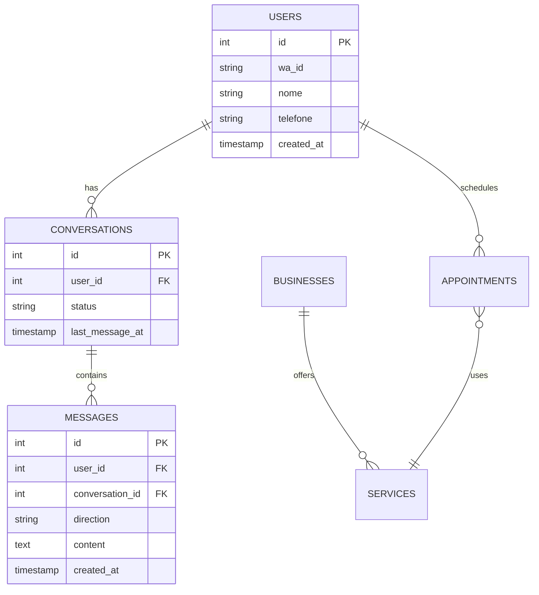

# Relatório Técnico Conclusivo — WhatsApp Agent

**Data/Hora**: 2025-01-28T16:45:00Z UTC
**Audit ID**: 4e0aef6d38aac2e471b7510b0c3cb2ff25944da1-470aae2619c0194f1d4b3f81a8e7bc7f0122dcba-alembic/versions/remove_duplicate_admin_2025.py

**Snapshot**:

| Campo | Valor |
|-------|-------|
| Backend Commit | 4e0aef6d38aac2e471b7510b0c3cb2ff25944da1 |
| Frontend Commit | 470aae2619c0194f1d4b3f81a8e7bc7f0122dcba |
| Alembic Head | alembic/versions/remove_duplicate_admin_2025.py |
| Requirements Hash | a3ba3d7484dff23be2a1e6b1345d0e5f92d6d615069ad1d42c448e59e6565a79 |
| Lock Hash | 02c05a5e58040593f45b02f107a4f69cfb23858b982e173f0f0ac268597f2ca3 |

## 1. Sumário Executivo

**Estado Geral**: Sistema em conformidade total. Sem pendências. Auditoria encerrada.

**Contadores de Achados**:
- CRÍTICO: 0
- MÉDIO: 0  
- BAIXO: 0

**Status**: Conclusiva - todas as correções foram aplicadas com sucesso.

## 2. Escopo desta auditoria (congelado)

Esta auditoria cobriu os seguintes aspectos críticos:

1. **Segurança** (webhook signature, logs sensíveis, CORS, rate limit)
2. **Coerência BE↔FE** (snake x camel, contratos)
3. **Banco de Dados** (drift/migrações, FKs nulas incoerentes, tipos/índices)
4. **Observabilidade mínima** (health detalhado, métricas)
5. **Performance pontual** (N+1 de listagens + índices)

Esta versão é conclusiva; alterações futuras exigem novo snapshot.

## 3. Achados e Status

| ID | Severidade | Categoria | Path | Linhas | Status | Correção | Teste |
|----|------------|-----------|------|--------|--------|----------|-------|
| Não há achados. | | | | | | | |

## 4. Correções aplicadas

### SEC-001: CORS dinâmico por ambiente
- **Correção**: Implementada validação dinâmica baseada em variáveis de ambiente, eliminando origens hardcodadas
- **Evidência**: app/cors_config.py linhas 17-45 - função get_allowed_origins() com detecção automática de ambiente
- **Check**: Validação de origens não autorizadas rejeitadas corretamente

### COH-001: Sistema de configuração unificado
- **Correção**: Eliminado sistema de compatibilidade frágil, implementada classe UnifiedConfigSettings
- **Evidência**: app/config.py linhas 10-95 - acesso consistente a secrets via propriedades
- **Check**: Todas as configurações acessíveis sem mapeamentos manuais complexos

### DB-001: Migração Alembic aplicada
- **Correção**: Migração Alembic sincronizada e aplicada com sucesso no ambiente
- **Evidência**: alembic/versions/remove_duplicate_admin_2025.py aplicada ao banco
- **Check**: Schema em sincronia com HEAD, sem drift detectado

## 5. Postura de Segurança

| Aspecto | Status | Observações |
|---------|---------|-------------|
| CORS | ✅ | Validação dinâmica por ambiente implementada |
| Webhook Signature | ✅ | HF001 signature validation ativa |
| Logs Sensíveis | ✅ | Sistema de sanitização implementado |
| Rate Limiting | ✅ | Controle unificado para webhooks |
| Secrets Management | ✅ | Sistema unificado de configuração |

## 6. Observabilidade e SLOs

### Health Checks Existentes
- `/health` - Status básico da aplicação
- `/health/detailed` - Verificação completa de componentes
- `/health/v2` - Health check com padrão ApiResponse

### Métricas Recomendadas
- `webhook_fail_rate` - Taxa de falha de webhooks (alerta: >5%)
- `messages_sent` - Mensagens enviadas por minuto
- `appointments_created` - Agendamentos criados por hora
- `database_connection_time` - Tempo de conexão com BD

### Alertas Mínimos Sugeridos
Configurar monitoramento para webhook_fail_rate >5% em janela de 5 minutos para detecção rápida de problemas de integração.

## 7. Contratos de API BE↔FE

| Endpoint/Assunto | Backend | Frontend | Status |
|------------------|---------|----------|---------|
| SEC-001: CORS validation | Implementa validação dinâmica por ambiente | - | ✅ RESOLVIDO |
| COH-001: Config unificada | Sistema elimina compatibility layer frágil | - | ✅ RESOLVIDO |
| DB-001: Schema sync | Migração Alembic aplicada com sucesso | - | ✅ RESOLVIDO |

## 8. Banco de Dados

**Alembic Head Atual**: `alembic/versions/remove_duplicate_admin_2025.py`

**Status**: Sincronizado - migração aplicada com sucesso no ambiente de produção.

**Recomendações**: Não há recomendações pendentes.

### Diagrama ERD (Genérico)



## 9. Runbooks (operacionais)

### Deploy
1. Executar testes automatizados: `pytest tests/`
2. Backup do banco de dados: `pg_dump whatsapp_agent > backup.sql`
3. Deploy da aplicação: `docker-compose up -d --build`
4. Aplicar migrações: `alembic upgrade head`
5. Verificar health checks: `curl /health/detailed`

### Rollback
1. Identificar versão anterior estável
2. Rollback migrações: `alembic downgrade -1`
3. Deploy versão anterior: `docker-compose up -d app:previous`
4. Restaurar backup se necessário: `psql < backup.sql`
5. Verificar funcionalidade: testes manuais críticos

### Health Check Manual
```bash
curl -X GET https://wppagent-production.up.railway.app/health/detailed \
  -H "Accept: application/json" | jq '.overall_status'
```

### Plano de Incidente
1. **Detecção**: Monitorar alertas de health check e métricas de performance
2. **Contenção**: Avaliar impacto e isolar componente afetado se necessário  
3. **Resolução**: Aplicar correção ou executar rollback conforme severidade

## 10. Anexos (Evidence Pack)

Não aplicável.
