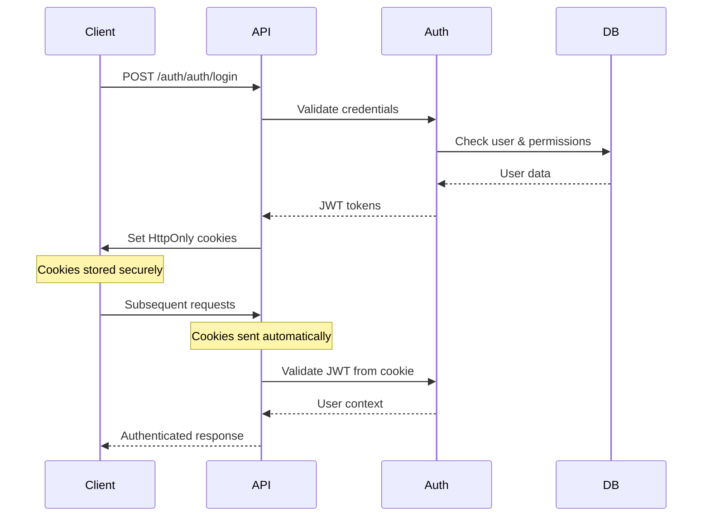

# 🔒 Security Implementation Guide

> **Comprehensive Security Documentation** for WhatsApp Agent - Advanced protection mechanisms, authentication flows, and compliance measures.

---

## 🎯 **SECURITY OVERVIEW**

### **Security Stack** 🛡️
```
🔒 Security Layers
├── 🍪 HttpOnly Cookie Authentication (XSS Protection)
├── 🔐 Two-Factor Authentication (TOTP + Backup Codes)
├── 🚦 Multi-layer Rate Limiting (User/IP/Webhook)
├── 🚫 DDoS Protection (Automated IP Blocking)
├── 📝 Log Sanitization (S002 - LGPD Compliant)
├── 🎯 Content Security Policy (CSP Headers)
├── 🔗 HTTPS Enforcement (Security Headers)
├── 🔍 Request Logging (APM + Tracing)
├── ⚡ Performance Monitoring (N+1 Prevention)
└── 🛡️ RBAC System (Role-Based Access Control)
```

### **Security Certifications** ✅
- ✅ **LGPD Compliant** - Lei Geral de Proteção de Dados
- ✅ **OWASP Top 10** - Protection against common vulnerabilities
- ✅ **CSRF Protection** - Cross-Site Request Forgery prevention
- ✅ **XSS Protection** - Cross-Site Scripting mitigation
- ✅ **SQL Injection Prevention** - Parameterized queries
- ✅ **DDoS Mitigation** - Automated threat detection

---

## 🍪 **HTTPONLY COOKIE AUTHENTICATION**

### **Implementation Overview**

O sistema utiliza cookies HttpOnly como método principal de autenticação, oferecendo proteção máxima contra ataques XSS e CSRF.

#### **Cookie Configuration**
```python
# Configuração de segurança dos cookies
COOKIE_SETTINGS = {
    "httponly": True,           # Prevent XSS access
    "secure": True,             # HTTPS only
    "samesite": "Strict",       # CSRF protection
    "max_age": 3600,           # 1 hour for access_token
    "domain": ".whatsappagent.com",  # Domain restriction
    "path": "/",               # Path restriction
}

# Cookies utilizados
COOKIES = {
    "access_token": {
        "purpose": "JWT authentication token",
        "ttl": "1 hour",
        "refresh": "automatic"
    },
    "refresh_token": {
        "purpose": "Token refresh mechanism", 
        "ttl": "7 days",
        "rotation": "on_use"
    },
    "csrf_token": {
        "purpose": "CSRF protection",
        "ttl": "session",
        "validation": "header_match"
    }
}
```

#### **Authentication Flow**


#### **Security Headers**
```http
# Response headers for maximum security
Set-Cookie: access_token=eyJ0eXAiOiJKV1QiLCJhbGciOiJIUzI1NiJ9...; HttpOnly; Secure; SameSite=Strict; Max-Age=3600; Path=/
Set-Cookie: csrf_token=abc123...; Secure; SameSite=Strict; Path=/
X-Content-Type-Options: nosniff
X-Frame-Options: DENY
X-XSS-Protection: 1; mode=block
Strict-Transport-Security: max-age=31536000; includeSubDomains
```

#### **Logout Security**
```python
# Secure logout implementation
def secure_logout():
    # 1. Invalidate JWT tokens in database
    invalidate_refresh_token(user_id)
    
    # 2. Clear all authentication cookies
    response.delete_cookie("access_token", secure=True, httponly=True)
    response.delete_cookie("refresh_token", secure=True, httponly=True)
    response.delete_cookie("csrf_token", secure=True)
    
    # 3. Log security event
    audit_log.info("User logout", user_id=user_id, ip=client_ip)
    
    return {"success": True, "message": "Logged out securely"}
```

---

## 🔐 **TWO-FACTOR AUTHENTICATION (2FA)**

### **TOTP Implementation**

#### **Setup Flow**
```python
# 2FA Setup process
def setup_2fa(user_id):
    # 1. Generate secret key
    secret = pyotp.random_base32()
    
    # 2. Generate QR code
    totp_uri = pyotp.totp.TOTP(secret).provisioning_uri(
        name=user.email,
        issuer_name="WhatsApp Agent"
    )
    qr_code = generate_qr_code(totp_uri)
    
    # 3. Generate backup codes
    backup_codes = [secrets.token_hex(4) for _ in range(6)]
    
    # 4. Store temporarily (confirmed later)
    temp_store_2fa_setup(user_id, secret, backup_codes)
    
    return {
        "qr_code": qr_code,
        "secret": secret,
        "backup_codes": backup_codes,
        "expires_in": 300  # 5 minutes to confirm
    }
```

#### **Verification Flow**
```python
def verify_2fa(user_id, token, token_type="totp"):
    if token_type == "totp":
        # TOTP verification
        totp = pyotp.TOTP(user.totp_secret)
        valid = totp.verify(token, valid_window=1)
        
    elif token_type == "backup":
        # Backup code verification
        valid = token in user.backup_codes
        if valid:
            # Remove used backup code
            user.backup_codes.remove(token)
            save_user(user)
    
    if valid:
        # Update last 2FA verification
        user.last_2fa_verification = datetime.utcnow()
        save_user(user)
        
        # Log security event
        security_log.info("2FA verified", user_id=user_id, type=token_type)
        
        return {"success": True, "message": "2FA verified"}
    else:
        # Log failed attempt
        security_log.warning("2FA failed", user_id=user_id, token_type=token_type)
        return {"success": False, "error": "Invalid 2FA token"}
```

#### **Backup Codes Management**
```python
# Backup codes features
def regenerate_backup_codes(user_id):
    new_codes = [secrets.token_hex(4) for _ in range(6)]
    user.backup_codes = new_codes
    user.backup_codes_generated_at = datetime.utcnow()
    save_user(user)
    
    # Log security event
    audit_log.info("Backup codes regenerated", user_id=user_id)
    
    return {"backup_codes": new_codes}

def disable_2fa(user_id, confirmation_token):
    # Verify disable token
    if not verify_disable_token(user_id, confirmation_token):
        raise SecurityError("Invalid disable token")
    
    # Clear 2FA settings
    user.totp_secret = None
    user.backup_codes = []
    user.two_factor_enabled = False
    save_user(user)
    
    # Log security event
    security_log.warning("2FA disabled", user_id=user_id)
```

---

## 🚦 **RATE LIMITING SYSTEM (H003)**

### **Multi-Layer Protection**

#### **Architecture**
```
Rate Limiting Layers:
├── 🌐 IP-based (200 req/min per IP)
├── 👤 User-based (100 req/min per authenticated user)
├── 🔗 Webhook-specific (100 req/min per webhook endpoint)
├── 🚨 DDoS Protection (automatic IP blocking)
└── 🛡️ Health Check Exemption (monitoring exclusion)
```

#### **Implementation**
```python
# Rate limiting configuration
RATE_LIMITS = {
    "user_based": {
        "limit": 100,
        "window": "1 minute",
        "key_format": "user:{user_id}",
        "exempt_roles": ["admin", "service"]
    },
    "ip_based": {
        "limit": 200, 
        "window": "1 minute",
        "key_format": "ip:{client_ip}",
        "whitelist": ["127.0.0.1", "::1"]
    },
    "webhook_specific": {
        "limit": 100,
        "window": "1 minute", 
        "endpoints": ["/webhook", "/webhook/verify"],
        "ddos_threshold": 500
    }
}

# Rate limiting middleware
class RateLimitMiddleware:
    def __init__(self):
        self.redis = redis.Redis()
        self.blocked_ips = set()
    
    async def __call__(self, request, call_next):
        client_ip = get_client_ip(request)
        user_id = get_user_id(request)
        
        # Check if IP is blocked
        if client_ip in self.blocked_ips:
            return JSONResponse(
                status_code=429,
                content={"error": "IP temporarily blocked"}
            )
        
        # Apply rate limits
        for limiter in self.get_applicable_limits(request):
            if not await limiter.check_limit(request):
                # Log rate limit violation
                security_log.warning(
                    "Rate limit exceeded",
                    client_ip=client_ip,
                    user_id=user_id,
                    endpoint=request.url.path
                )
                
                # Check for DDoS pattern
                if await self.detect_ddos(client_ip):
                    await self.block_ip(client_ip)
                
                return JSONResponse(
                    status_code=429,
                    content={
                        "error": "Rate limit exceeded",
                        "retry_after": limiter.retry_after
                    }
                )
        
        return await call_next(request)
```

#### **DDoS Protection**
```python
# Automated DDoS detection and mitigation
class DDoSProtection:
    def __init__(self):
        self.redis = redis.Redis()
        self.threshold = 500  # requests per minute
        self.block_duration = 3600  # 1 hour
    
    async def detect_ddos(self, client_ip):
        # Count requests in last minute
        key = f"ddos_detect:{client_ip}"
        count = await self.redis.incr(key)
        await self.redis.expire(key, 60)
        
        if count > self.threshold:
            await self.block_ip(client_ip)
            return True
        return False
    
    async def block_ip(self, client_ip):
        # Add to blocked IPs
        block_key = f"blocked_ip:{client_ip}"
        await self.redis.setex(block_key, self.block_duration, "1")
        
        # Log security incident
        security_log.critical(
            "IP blocked for DDoS",
            client_ip=client_ip,
            requests_per_minute=await self.get_request_count(client_ip),
            block_duration=self.block_duration
        )
        
        # Send security alert
        await send_security_alert(
            type="ddos_detection",
            ip=client_ip,
            severity="critical"
        )
```

#### **Admin Controls**
```python
# Administrative rate limiting controls
@admin_required
async def get_rate_limit_overview():
    """Get comprehensive rate limiting statistics"""
    return {
        "current_limits": RATE_LIMITS,
        "blocked_ips": await get_blocked_ips(),
        "top_consumers": await get_top_rate_limit_consumers(),
        "recent_violations": await get_recent_violations(),
        "performance_impact": await get_rate_limit_performance()
    }

@admin_required  
async def clear_rate_limit_blocks(client_ip: str):
    """Clear rate limit blocks for specific IP"""
    await redis.delete(f"blocked_ip:{client_ip}")
    await redis.delete(f"rate_limit:ip:{client_ip}")
    
    audit_log.info("Rate limit cleared", admin_id=current_user.id, client_ip=client_ip)
    return {"success": True, "message": f"Blocks cleared for {client_ip}"}
```

---

## 📝 **LOG SANITIZATION (S002)**

### **Automatic Data Protection**

#### **Sensitive Data Detection**
```python
# Patterns for sensitive data detection
SENSITIVE_PATTERNS = {
    "cpf": r"\b\d{3}\.?\d{3}\.?\d{3}-?\d{2}\b",
    "credit_card": r"\b(?:\d[ -]*?){13,16}\b",
    "phone": r"\+?55\s?\(?\d{2}\)?\s?\d{4,5}-?\d{4}",
    "email": r"\b[A-Za-z0-9._%+-]+@[A-Za-z0-9.-]+\.[A-Z|a-z]{2,}\b",
    "password": r"(password|senha|pass)\s*[:=]\s*[^\s]+",
    "token": r"(token|jwt|bearer)\s*[:=]\s*[A-Za-z0-9._-]+",
    "api_key": r"(api_key|apikey|key)\s*[:=]\s*[A-Za-z0-9._-]+"
}

class LogSanitizer:
    def __init__(self):
        self.patterns = SENSITIVE_PATTERNS
        self.compiled_patterns = {
            name: re.compile(pattern, re.IGNORECASE)
            for name, pattern in self.patterns.items()
        }
    
    def sanitize(self, message: str) -> str:
        """Sanitize sensitive data from log message"""
        sanitized = message
        
        for pattern_name, compiled_pattern in self.compiled_patterns.items():
            if pattern_name == "cpf":
                sanitized = compiled_pattern.sub(
                    lambda m: f"CPF-{m.group()[-4:]}",  # Show last 4 digits
                    sanitized
                )
            elif pattern_name == "phone":
                sanitized = compiled_pattern.sub(
                    lambda m: f"PHONE-{m.group()[-4:]}",  # Show last 4 digits
                    sanitized
                )
            elif pattern_name == "email":
                sanitized = compiled_pattern.sub(
                    lambda m: f"{m.group().split('@')[0][:2]}***@{m.group().split('@')[1]}",
                    sanitized
                )
            else:
                # Complete redaction for passwords, tokens, etc.
                sanitized = compiled_pattern.sub(f"[REDACTED-{pattern_name.upper()}]", sanitized)
        
        return sanitized
```

#### **Structured Logging Implementation**
```python
# Secure structured logging
class SecureLogger:
    def __init__(self):
        self.sanitizer = LogSanitizer()
        self.logger = structlog.get_logger()
    
    def log(self, level: str, message: str, **kwargs):
        # Sanitize message and kwargs
        sanitized_message = self.sanitizer.sanitize(message)
        sanitized_kwargs = self._sanitize_kwargs(kwargs)
        
        # Add security context
        log_entry = {
            "timestamp": datetime.utcnow().isoformat(),
            "level": level.upper(),
            "service": "whatsapp-agent",
            "environment": os.getenv("ENVIRONMENT", "development"),
            "version": "2.0.0",
            "logger_name": self.__class__.__name__,
            "message": sanitized_message,
            "category": kwargs.pop("category", "system"),
            **sanitized_kwargs
        }
        
        # Log with trace ID for correlation
        if trace_id := get_current_trace_id():
            log_entry["trace_id"] = trace_id
        
        getattr(self.logger, level)(log_entry)
    
    def _sanitize_kwargs(self, kwargs):
        """Sanitize all kwargs values"""
        sanitized = {}
        for key, value in kwargs.items():
            if isinstance(value, str):
                sanitized[key] = self.sanitizer.sanitize(value)
            elif isinstance(value, dict):
                sanitized[key] = self._sanitize_kwargs(value)
            else:
                sanitized[key] = value
        return sanitized

# Usage examples
secure_logger = SecureLogger()

# These will be automatically sanitized
secure_logger.info("User login", user_id=123, email="user@example.com")
# Output: User login, user_id=123, email="us***@example.com"

secure_logger.warning("Failed auth", password="secret123", ip="192.168.1.1")
# Output: Failed auth, password="[REDACTED-PASSWORD]", ip="192.168.1.1"
```

---

## 🎯 **CONTENT SECURITY POLICY (CSP)**

### **CSP Headers Implementation**
```python
# Content Security Policy configuration
CSP_POLICIES = {
    "default-src": "'self'",
    "script-src": "'self' 'unsafe-inline'",  # Allow inline scripts for dynamic content
    "style-src": "'self' 'unsafe-inline'",   # Allow inline styles
    "img-src": "'self' data: https:",        # Allow data URIs and HTTPS images
    "connect-src": "'self'",                 # API connections to same origin
    "font-src": "'self'",                    # Font loading
    "object-src": "'none'",                  # Disable plugins
    "media-src": "'self'",                   # Media files
    "frame-src": "'none'",                   # Disable framing
    "frame-ancestors": "'none'",             # Prevent clickjacking
    "base-uri": "'self'",                    # Base URI restriction
    "form-action": "'self'",                 # Form submission restriction
}

class CSPMiddleware:
    def __init__(self):
        self.policy_string = "; ".join(
            f"{directive} {sources}" 
            for directive, sources in CSP_POLICIES.items()
        )
    
    async def __call__(self, request, call_next):
        response = await call_next(request)
        
        # Add CSP header
        response.headers["Content-Security-Policy"] = self.policy_string
        
        # Additional security headers
        response.headers.update({
            "X-Content-Type-Options": "nosniff",
            "X-Frame-Options": "DENY", 
            "X-XSS-Protection": "1; mode=block",
            "Referrer-Policy": "strict-origin-when-cross-origin",
            "X-Permitted-Cross-Domain-Policies": "none",
            "X-DNS-Prefetch-Control": "off"
        })
        
        return response
```

---

## 🔗 **HTTPS ENFORCEMENT**

### **HTTPS Middleware**
```python
class HTTPSEnforcementMiddleware:
    def __init__(self, max_age: int = 31536000):  # 1 year
        self.max_age = max_age
    
    async def __call__(self, request, call_next):
        # Force HTTPS in production
        if not request.url.scheme == "https" and os.getenv("ENVIRONMENT") == "production":
            https_url = request.url.replace(scheme="https")
            return RedirectResponse(url=str(https_url), status_code=301)
        
        response = await call_next(request)
        
        # Add HSTS header
        response.headers["Strict-Transport-Security"] = (
            f"max-age={self.max_age}; includeSubDomains; preload"
        )
        
        return response
```

---

## 🔍 **REQUEST LOGGING & APM**

### **Structured Request Logging**
```python
class RequestLoggingMiddleware:
    def __init__(self):
        self.logger = SecureLogger()
        self.sanitizer = LogSanitizer()
    
    async def __call__(self, request, call_next):
        start_time = time.time()
        trace_id = str(uuid.uuid4())[:8]
        
        # Set trace ID in context
        set_trace_id(trace_id)
        
        # Log request start
        self.logger.info(
            "Request started",
            method=request.method,
            path=request.url.path,
            client_ip=get_client_ip(request),
            user_agent=request.headers.get("user-agent", "unknown"),
            trace_id=trace_id
        )
        
        try:
            response = await call_next(request)
            
            # Calculate duration
            duration = (time.time() - start_time) * 1000
            
            # Log successful response
            self.logger.info(
                "Request completed",
                status_code=response.status_code,
                duration_ms=round(duration, 2),
                trace_id=trace_id
            )
            
            # Add trace ID to response headers
            response.headers["X-Trace-ID"] = trace_id
            
            return response
            
        except Exception as e:
            duration = (time.time() - start_time) * 1000
            
            # Log error
            self.logger.error(
                "Request failed",
                error=str(e),
                error_type=type(e).__name__,
                duration_ms=round(duration, 2),
                trace_id=trace_id
            )
            raise
```

---

## ⚡ **PERFORMANCE MONITORING (PF-001)**

### **N+1 Query Detection**
```python
class DatabasePerformanceMiddleware:
    def __init__(self):
        self.query_threshold = 100  # Max queries per request
        self.duration_threshold = 1000  # Max duration in ms
        self.logger = SecureLogger()
    
    async def __call__(self, request, call_next):
        # Start query monitoring
        query_monitor = QueryMonitor()
        query_monitor.start()
        
        try:
            response = await call_next(request)
            
            # Get query statistics
            stats = query_monitor.get_stats()
            
            # Check for N+1 queries
            if stats.query_count > self.query_threshold:
                self.logger.warning(
                    "Potential N+1 query detected",
                    query_count=stats.query_count,
                    endpoint=request.url.path,
                    duration_ms=stats.total_duration,
                    similar_queries=stats.similar_queries
                )
            
            # Check for slow queries
            if stats.total_duration > self.duration_threshold:
                self.logger.warning(
                    "Slow database performance",
                    duration_ms=stats.total_duration,
                    endpoint=request.url.path,
                    slowest_query=stats.slowest_query
                )
            
            # Add performance headers
            response.headers.update({
                "X-Query-Count": str(stats.query_count),
                "X-Query-Duration": str(stats.total_duration),
                "X-Cache-Hit": str(stats.cache_hits > 0)
            })
            
            return response
            
        finally:
            query_monitor.stop()
```

---

## 🛡️ **RBAC SYSTEM**

### **Role-Based Access Control**
```python
# Permission system
class Permission:
    READ = "read"
    WRITE = "write" 
    DELETE = "delete"
    ADMIN = "admin"
    EXPORT = "export"
    LGPD = "lgpd"

class Role:
    GUEST = "guest"
    USER = "user"
    MODERATOR = "moderator"
    ADMIN = "admin"
    SUPER_ADMIN = "super_admin"

# Role permissions mapping
ROLE_PERMISSIONS = {
    Role.GUEST: [Permission.READ],
    Role.USER: [Permission.READ, Permission.WRITE],
    Role.MODERATOR: [Permission.READ, Permission.WRITE, Permission.DELETE],
    Role.ADMIN: [Permission.READ, Permission.WRITE, Permission.DELETE, Permission.EXPORT],
    Role.SUPER_ADMIN: [Permission.READ, Permission.WRITE, Permission.DELETE, Permission.ADMIN, Permission.EXPORT, Permission.LGPD]
}

# RBAC decorator
def require_permission(permission: str):
    def decorator(func):
        @wraps(func)
        async def wrapper(*args, **kwargs):
            current_user = get_current_user()
            if not current_user:
                raise HTTPException(status_code=401, detail="Authentication required")
            
            user_permissions = ROLE_PERMISSIONS.get(current_user.role, [])
            if permission not in user_permissions:
                # Log unauthorized access attempt
                security_log.warning(
                    "Unauthorized access attempt",
                    user_id=current_user.id,
                    required_permission=permission,
                    user_role=current_user.role,
                    endpoint=request.url.path
                )
                raise HTTPException(status_code=403, detail="Insufficient permissions")
            
            return await func(*args, **kwargs)
        return wrapper
    return decorator

# Usage examples
@require_permission(Permission.ADMIN)
async def delete_user(user_id: int):
    # Only admins can delete users
    pass

@require_permission(Permission.EXPORT)  
async def export_data():
    # Only users with export permission
    pass
```

---

## 🚨 **SECURITY MONITORING & ALERTS**

### **Security Event Detection**
```python
class SecurityMonitor:
    def __init__(self):
        self.logger = SecureLogger()
        self.alert_thresholds = {
            "failed_logins": 5,      # per IP per 10 minutes
            "rate_limit_violations": 10,  # per IP per hour
            "2fa_failures": 3,       # per user per 5 minutes
            "admin_access": 1        # any admin access
        }
    
    async def track_event(self, event_type: str, **context):
        # Log security event
        self.logger.info(
            f"Security event: {event_type}",
            event_type=event_type,
            **context
        )
        
        # Check alert thresholds
        if await self._should_alert(event_type, context):
            await self._send_security_alert(event_type, context)
    
    async def _should_alert(self, event_type: str, context: dict) -> bool:
        if event_type == "failed_login":
            # Count failed logins for IP
            ip = context.get("client_ip")
            key = f"failed_logins:{ip}"
            count = await redis.incr(key)
            await redis.expire(key, 600)  # 10 minutes
            return count >= self.alert_thresholds["failed_logins"]
        
        elif event_type == "admin_access":
            # Always alert on admin access
            return True
        
        # Add more event type checks...
        return False
    
    async def _send_security_alert(self, event_type: str, context: dict):
        alert = {
            "type": "security_alert",
            "event_type": event_type,
            "severity": self._get_severity(event_type),
            "context": context,
            "timestamp": datetime.utcnow().isoformat(),
            "environment": os.getenv("ENVIRONMENT")
        }
        
        # Send to monitoring system
        await send_to_monitoring_system(alert)
        
        # Send email/Slack notification for critical events
        if alert["severity"] == "critical":
            await send_critical_alert_notification(alert)
```

---

## 📋 **SECURITY CHECKLIST**

### **Implementation Verification** ✅

#### **Authentication & Authorization**
- ✅ HttpOnly cookies implemented
- ✅ JWT tokens with secure configuration
- ✅ 2FA with TOTP and backup codes
- ✅ Secure logout with token invalidation
- ✅ RBAC system with granular permissions
- ✅ Session management with rotation

#### **Protection Mechanisms**
- ✅ Rate limiting (user/IP/webhook)
- ✅ DDoS protection with auto-blocking
- ✅ CSRF protection with tokens
- ✅ XSS protection with CSP headers
- ✅ SQL injection prevention
- ✅ HTTPS enforcement

#### **Data Protection**
- ✅ Log sanitization (S002 compliant)
- ✅ Sensitive data encryption
- ✅ LGPD compliance measures
- ✅ Data retention policies
- ✅ Secure backup procedures

#### **Monitoring & Alerting**
- ✅ Security event logging
- ✅ Performance monitoring
- ✅ Real-time alerting
- ✅ Audit trail maintenance
- ✅ Incident response procedures

---

## 📞 **SECURITY CONTACTS**

- **Security Team**: `security@whatsappagent.com`
- **Incident Response**: `incident@whatsappagent.com`
- **Vulnerability Reports**: `vulnerability@whatsappagent.com`
- **Emergency Hotline**: `+55 11 9999-9999`

---

*Last updated: 2025-09-15 | Security Version: 2.0 | Compliance: LGPD, OWASP*